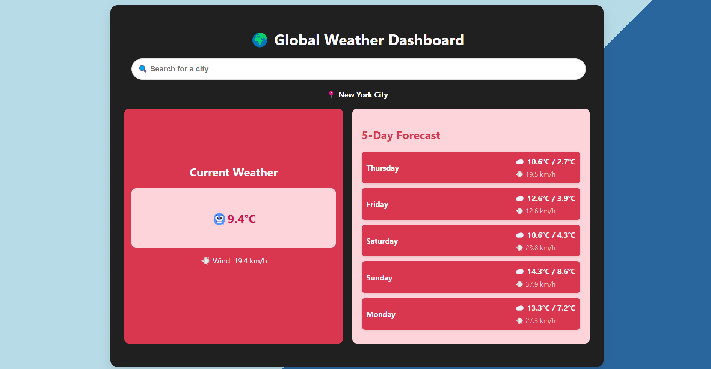

# 🌍Global Weather Dashboard
A simple and interactive weather dashboard that provides real-time weather updates and a 5-day forecast for any location worldwide.

# Features
 - 🌦 Current Weather: Get real-time temperature, wind speed, and weather conditions.
 - 📅 5-Day Forecast: View daily high/low temperatures and wind speeds.
 - 🔍 City Search: Autocomplete suggestions for city names.
 - 📍 Default Location: Shows weather for New York City initially.

# Technologies Used
 1. HTML - Structuring the dashboard
 2. CSS - Styling for a clean and modern look
 3. JavaScript - Fetching and displaying weather data dynamically
 4. Open-Meteo API - Real-time weather data
    Open-Meteo Geocoding API - City search suggestions

# view here: https://nandinee-sharma.github.io/WeatherDashBoard/

# 📸Preview

# Future Improvements
 1. Add more weather details (humidity, pressure, etc.)
 2. Improve UI/UX design
 3. Make it fully responsive
 4. Implement user location detection